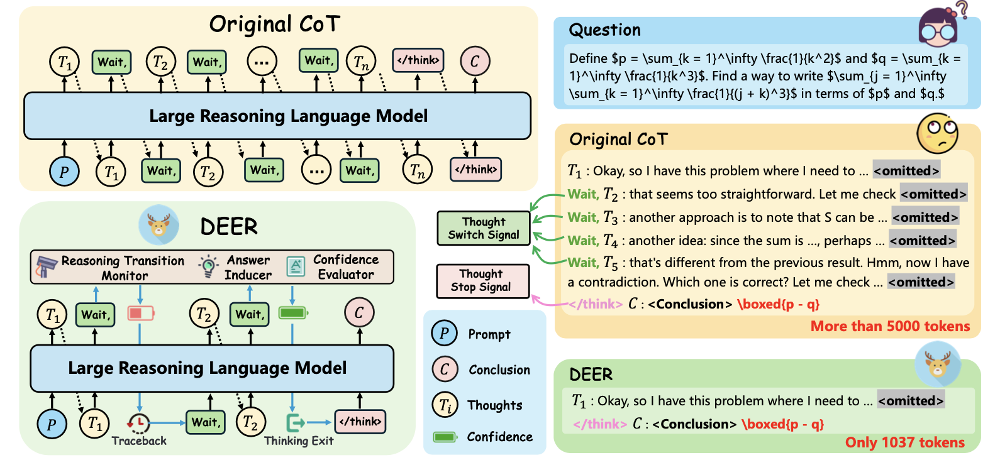
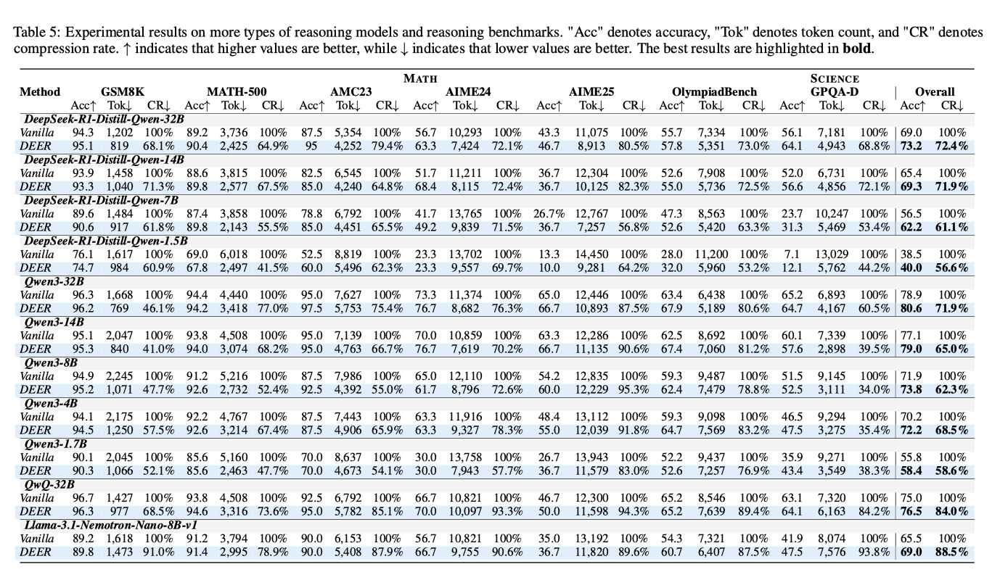
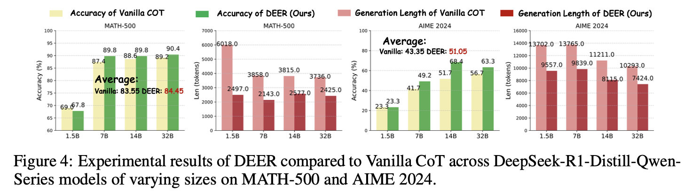
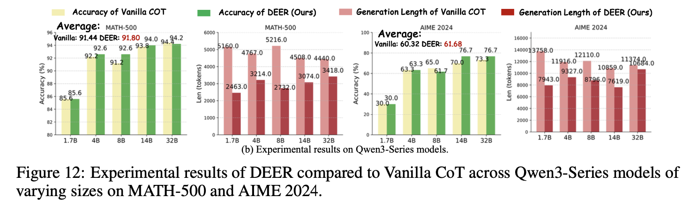

# DEER 🦌: Dynamic Early Exit in Reasoning Models
[](https://arxiv.org/abs/2504.15895)
[](https://opensource.org/licenses/MIT)
[](https://www.python.org/)
[](https://huggingface.co/)
[](https://github.com/vllm-project/vllm)

This is the repository of our paper: [Dynamic Early Exit in Reasoning Models](https://arxiv.org/abs/2504.15895).


<p align="center">        </p>

**DEER** monitors model behavior at potential reasoning transition points and dynamically terminates the next reasoning chain’s generation when the model exhibits high confidence in a trial answer. It is consistently effective on 11 cutting-edge reasoning LLMs of varying series and sizes, reducing the length of CoT sequences by an average of **19.1% - 80.1%** while improving accuracy by **0.3% - 5.0%**.

---

## 🔥 **Latest Updates**
- **[2025/05/20]** Released DEER code for mathematical reasoning tasks (HuggingFace & vLLM).
- **[Coming Soon]** DEER for code generation tasks & Branch-Parallel Decoding Acceleration.

---

## 🎯 Key Results
Results on 11 reasoning models with 16k token budgets. "Acc" denotes accuracy, "Tok" denotes token count, and "CR" denotes compression rate.
<p align="center">        </p>


Experimental results presented in bar charts.

<p align="center">        </p>

<p align="center">        </p>

---


## 🚀 Quick Start
### 1. Installation
```bash
git clone https://github.com/yourusername/DEER.git
cd DEER
pip install -r requirements.txt
```

### 2. DEER on vLLM (Recommended)
Considering efficiency, we recommend reproducing the results using the code based on the **vLLM** framework.

#### For Most Reasoning Models
```
CUDA_VISIBLE_DEVICES=1 python ../vllm-deer.py \
    --model_name_or_path "./DeepSeek-R1-Distill-Qwen-14B" \
    --dataset_dir "./data/" \
    --output_path "./outputs" \
    --dataset "math" \
    --threshold 0.95 \
    --max_generated_tokens 16000 \
    --think_ratio 0.6 \
    --batch_size 2000 \
    --policy avg1 \
    --dtype bfloat16 \
    --gpu-memory-utilization 0.9 \ 
```
or run:
```bash
bash ./bashes/bash-vllm-deer.sh.
```


#### For Qwen3 Models

```
CUDA_VISIBLE_DEVICES=1 python ../vllm-deer-qwen3.py \
    --model_name_or_path "./Qwen3-4B" \
    --dataset_dir "./data/" \
    --output_path "./outputs" \
    --dataset "math" \
    --threshold 0.95 \
    --max_generated_tokens 16000 \
    --think_ratio 0.8 \
    --batch_size 2000 \
    --dtype bfloat16 \
    --policy avg2 \
    --gpu-memory-utilization 0.9 \
```
or run:
```bash
bash ./bashes/bash-vllm-deer-qwen3.sh.
```
In our experiments, we found that Qwen3-series models tend to be over-confident in confidence prediction, so we made some modifications to its implementation. 
- The calculation of answer confidence was changed from arithmetic mean to geometric mean.
- An additional condition must be satisfied for early exit: the model must generate <\/think> after the trial answer.

### 3. DEER on Transformers

For inference using HuggingFace Transformers (without vLLM), run:
```bash
bash ./bashes/bash-vanilla-deer.sh
```


## 📊 Evaluation

DEER currently supports evaluation on 7 reasoning benchmarks. The rule-based evaluation for these benchmarks is based on the code implementation from the project [LIMO](https://github.com/GAIR-NLP/LIMO/tree/main).


```
python ../check.py \
    --model_name_or_path "./DeepSeek-R1-Distill-Qwen-14B" \
    --data_name "math" \
    --generation_path "your_output.jsonl" \
```
or run
```bash
bash ./bashes/bash-check-correct.sh
```


## 📜 Citation
If you use DEER in your research, please cite our paper:
```bibtex
@article{yang2025dynamic,
  title={Dynamic Early Exit in Reasoning Models},
  author={Yang, Chenxu and Si, Qingyi and Duan, Yongjie and Zhu, Zheliang and Zhu, Chenyu and Lin, Zheng and Cao, Li and Wang, Weiping},
  journal={arXiv preprint arXiv:2504.15895},
  year={2025}
}
```
## 💬 Community

Join our WeChat group for discussions:
<p align="center">        </p>
